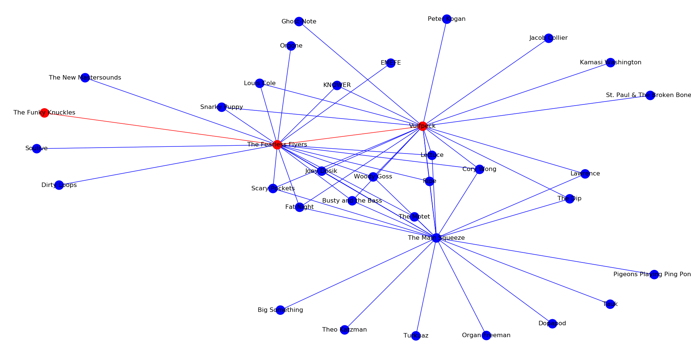

## SpotifyArtistPath

### Description
This program uses [breadth-first search](https://en.wikipedia.org/wiki/Breadth-first_search) on related artists in Spotify to find the shortest path between two artists. 

 

Uses [Spotipy](https://github.com/plamere/spotipy), a Spotify Web API wrapper for Python. You can check out more info about the Spotify Web API [here](https://developer.spotify.com/documentation/web-api/quick-start/).

### Getting Started

#### Initial Setup
In it's current state, in order to try the code out, you will need to create an account on [Spotify](https://www.spotify.com/us/).

Once this has been done you will need to login to the [Spotify for Developers](https://developer.spotify.com/dashboard/login) page.

Next, go to the dashboard at the top and select the "Create An App" option. Name it whatever you want.

#### Setting Environment variables
On the app page you should have a Client ID on the left hand side as well as a "Show Client Secret" option. We will need these in order to get information from Spotify.

You can store these in code, however, this is not recommended. A better option is to store them in environment variables.

On linux this can be done by running:

> export SPOTIPY_CLIENT_ID="Spotify_Client_ID"
> export SPOTIPY_CLIENT_SECRET="Spotify_Client_Secret"
> export SPOTIPY_REDIRECT_URI="https://www.google.com/"

For windows users, please check [this](https://www.techjunkie.com/environment-variables-windows-10/) link on how to set environment variables.

Once this is done you should be all set.
